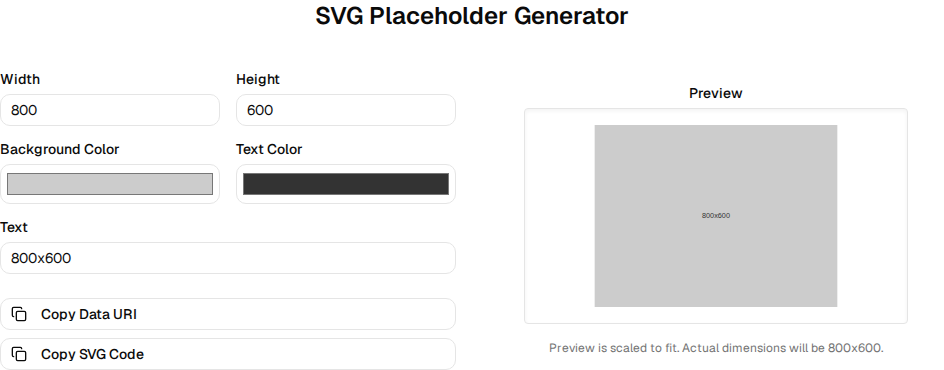

**PR Title:** feat: SVG Placeholder Generator

**The Problem Solved:** Provides a fast, interactive way for developers and designers to generate SVG placeholders for images in mockups, outputting both Data URIs and raw SVG code natively without external dependencies.

**Visuals:** 

**Implementation Journey:**
- Explored existing tools and found a gap for image placeholder generation in the Generators category.
- Created `SvgPlaceholderGenerator` component using Shadcn UI inputs (`Label`, `Input`, `Button`) for width, height, colors, and text.
- Rendered the SVG natively for real-time visual feedback.
- Used `navigator.clipboard.writeText` to provide single-click copying for Data URIs and SVG code.
- Registered the tool in `src/lib/tools.tsx`.
- Implemented Vitest tests mocking the clipboard API to verify behavior without regressions.
- Verified functionality visually with a Playwright screenshot.

**Tradeoffs & Assumptions:**
- I assumed the simplest approach was best: instead of creating a backend or manipulating Blob URLs, generating and rendering the SVG directly in the React tree is lightweight and robust.
- The 3 paths brainstormed were: 1) Blob URL rendering, 2) Text-only data URI output, 3) Native React SVG rendering with one-click copy actions. I chose the third for its superior UX and simplicity.

**Testing Instructions:**
1. Check out the branch: `git checkout feature/svg-placeholder-generator`
2. Start the dev server: `npm start`
3. Navigate to `#svg-placeholder-generator` via the side nav.
4. Modify the width, height, and colors. Observe the preview update in real-time.
5. Click "Copy Data URI" and verify the copied content starts with `data:image/svg+xml;base64,`.
6. Run unit tests locally: `npm test` (or `npx vitest run src/components/svg-placeholder-generator.test.tsx`)

**Action Item:** `git push --set-upstream origin feature/svg-placeholder-generator && gh pr create --fill`
